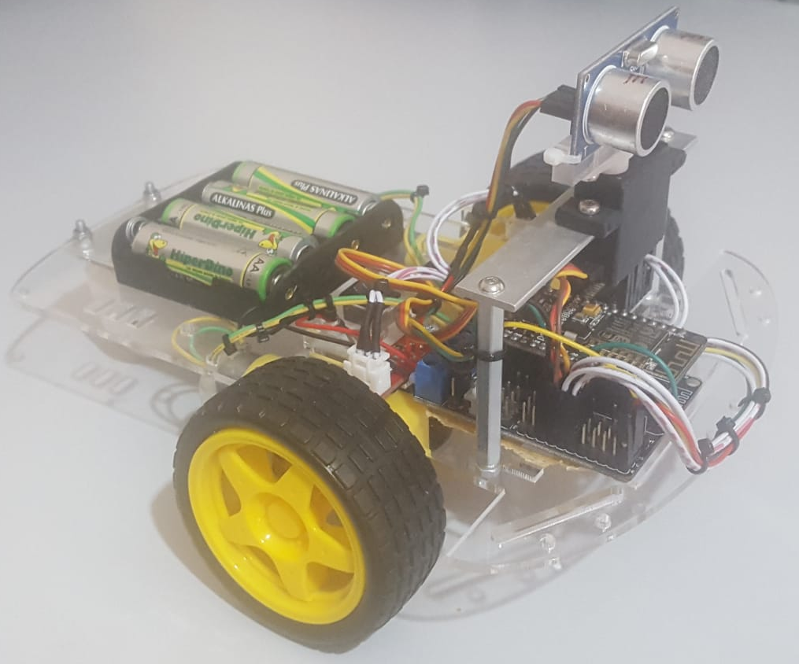
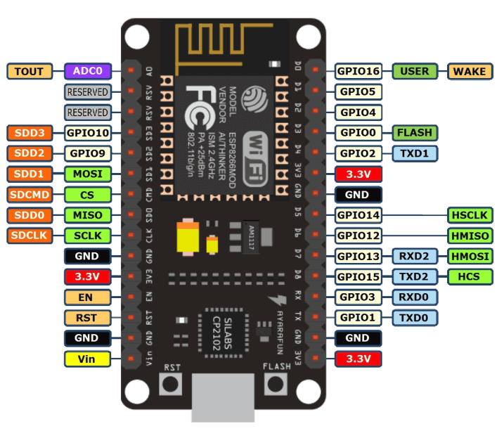
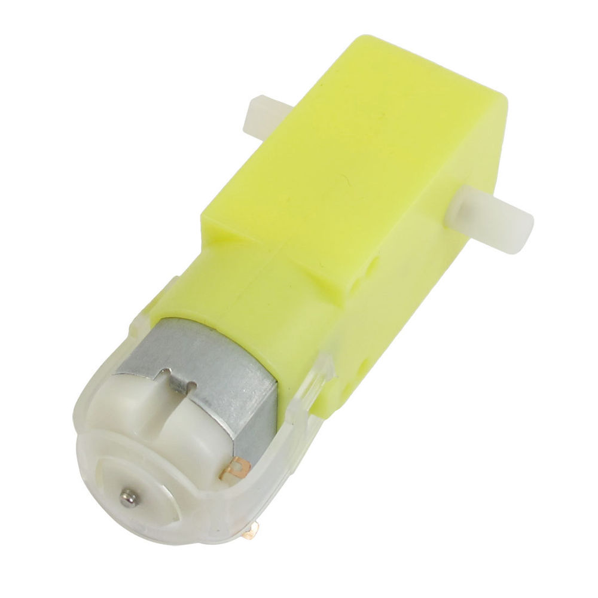

# RoboMat-Project

## Introduction

## Pinout

ESP8266 | Arduino | Description
------------ | ------------- | ------------
D0 | 16 | Ultrasonic Trigger
D1 | 5  | Power Motor Right
D2 | 4  | Power Motor Left
D3 | 0  | Direction Motor Right
D4 | 2  | Direction Motor Left
D5 | 14 | Encoder Motor Right
D6 | 12 | Encoder Motor Left
D7 | 13 | Servo
D8 | 15 | Untrasonic Echo

## Components

## Chassis

### Battery

4 x alkaline battery : 1.5V & 1700-2800mA

### Single Board Computer

NodeMCU board base on ESP8266

Characteristic  | Value
------------ | -------------

Processor |  Tensilica L106 32-bit
Processor Frecuency | 80MHz
Memory SRAM user |  50kB
Memory Flash | 16Mbytes
Wifi | 802.11 b/g/n/e/i
GPIO | 17 GPIO
Operating Voltage | 3.0V ~ 3.6V
Operating Current | Average Value: 80mA
Output Voltage pins | 3.3V
Current nominal pins | 12mA

### Motor

Characteristic  | Value
------------ | -------------
Operating voltage | 3V ~ 6V DC ( recommended  5V )
Maximum torque | 800g.cm
Speed without load | 90±10rpm
Reduction ratio | 1:48
No Load current | 190mA ( maximum 250mA)
Stall Current | ~1A

### Wheel

### Caster

### Encoder

### Encoder Filter

### Servo

### Ultrasonic

